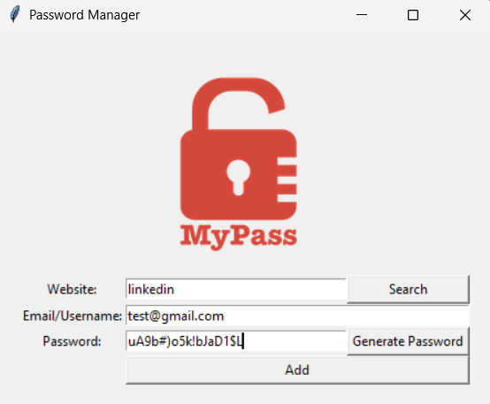

# PasswordManager

A simple password manager built with Python’s `tkinter` library.  
The app lets users generate strong passwords, save them securely in a local JSON file, and search for saved credentials.

## Installation guide

This project requires only one external dependency — `pyperclip` for copying passwords to the clipboard.

1. Make sure you have **Python 3.6 or higher** installed.  
2. Install the required module: `pip install requirements.txt`
3. Download the **PasswordManager** project. 
4. Open a terminal and navigate to the project folder.
4. Run the script: `python main.py`

## Usage guide

After launching the program, a window will appear where you can:

- Enter a **website**, **email**, and **password**  
- Click **Generate Password** to create a random password (automatically copied to clipboard)  
- Click **Add** to save the data in `data/data.json`  
- Click **Search** to retrieve saved credentials by website name  

All saved entries are stored locally in a JSON file.

## License

This project is licensed under the **MIT License** — see the LICENSE file for details.
